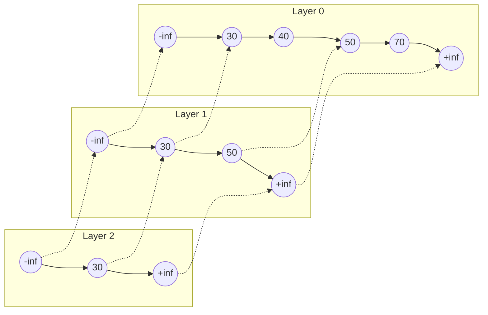

# Module 9 - Randomized Verification, Advanced Probabilistic Invariants, and Distributed Models

**MOC:** [[Algorithms 1 MOC]]
**Course:** [[Algorithms 1]]

# Algorithms 1: Ultimate Study Guide

## Module 9: Randomized Verification, Advanced Probabilistic Invariants, and Distributed Models

This module compiles the advanced randomized verification, tail bound mechanics, and distributed models spanning **Syllabus Weeks 8, 9, 10, 11, 12, and 13**. It details algebraic checks, concentration inequalities, randomized graph structural contractions, and distributed symmetry breaking.

### 1. Foundational Vocabulary & Randomized Verification

In past exams, you are frequently required to replace deterministic lower bounds with highly efficient non-deterministic checking routines. Randomized verification reduces structural processing bottlenecks by validating solutions instead of computing them from scratch.

#### 1.1 Freivalds' Algorithm (אלגוריתם פרייבלדס) `[Seen in: Class Lectures]`

- **Objective:** Given three $n \times n$ matrices $A, B,$ and $C$, verify whether $A \cdot B = C$ in $O(n^2)$ time, bypassing the deterministic matrix multiplication lower bound $O(n^\omega)$.
    
- **Operational Strategy:** Instead of computing $A \cdot B$, select a random binary vector $r = (r_1, r_2, \dots, r_n)^T \in \{0, 1\}^n$ where each $\Pr(r_i = 1) = \frac{1}{2}$. Evaluate the matrix-vector products step-by-step from right to left to maintain $O(n^2)$ operations:
    
    $$A \cdot (B \cdot r) = C \cdot r$$
    

##### The Error Probability Bound Invariant

- If $A \cdot B == C$, then $A(Br) - Cr$ always equals the zero vector $\vec{0}$.
    
- If $A \cdot B \neq C$, the probability of false convergence (a false positive) is strictly bounded by:
    
    $$\Pr_{r \in \{0,1\}^n}(A \cdot B \cdot r == C \cdot r \mid A \cdot B \neq C) \le \frac{1}{2}$$
    
- **Amplification via Repetition:** Running the routine independently $k$ times drops the error probability to at most $\left(\frac{1}{2}\right)^k$. Choosing $k = \Theta(\log n)$ yields an error probability of $O\left(\frac{1}{n}\right)$ within $\mathbf{O(n^2 \log n)}$ total time.

##### Formal Proof of Freivalds' Error Probability:
1.  Let $D = A \cdot B - C$. Since $A \cdot B \neq C$, the matrix $D \neq 0$, meaning there is at least one non-zero entry in $D$. Let this non-zero entry be $D_{i,j} \neq 0$ at row $i$ and column $j$.
2.  Consider the $i$-th entry of the vector $D \cdot r$:
    $$(D \cdot r)_i = \sum_{k=1}^n D_{i,k} r_k = D_{i,j} r_j + \sum_{k \neq j} D_{i,k} r_k$$
3.  The algorithm returns `True` (incorrectly claiming equality) only if $D \cdot r = \vec{0}$, which requires $(D \cdot r)_i = 0$.
4.  By the law of total probability, we condition on the choices of all random variables $r_k$ for $k \neq j$. Let $S = \sum_{k \neq j} D_{i,k} r_k$ be the sum of these other terms. For $(D \cdot r)_i$ to be zero, we must have:
    $$D_{i,j} r_j + S = 0 \implies D_{i,j} r_j = -S$$
5.  Since $D_{i,j} \neq 0$ and $r_j \in \{0, 1\}$, there is at most *one* value of $r_j$ that satisfies this equation:
    *   If $S = 0$, then $r_j$ must be 0 (since $D_{i,j} \neq 0$).
    *   If $S = -D_{i,j}$, then $r_j$ must be 1.
    *   If $S$ is any other value, no choice of $r_j \in \{0, 1\}$ can satisfy it.
6.  Since $r_j$ is chosen uniformly at random from $\{0, 1\}$ independently of the other $r_k$, the probability that $r_j$ takes this unique satisfying value is at most $\frac{1}{2}$.
7.  Thus, the probability that $(D \cdot r)_i = 0$ given any fixed choices for all other $r_k$ is at most $\frac{1}{2}$. Summing over all possible configurations of the other $r_k$:
    $$\Pr(D \cdot r = \vec{0}) \le \Pr((D \cdot r)_i = 0) \le \frac{1}{2} \quad \blacksquare$$

    

#### 1.2 The Light/Heavy Thresholding Technique (טכניקת קל-כבד)

This technique solves algorithms by dividing inputs into **Light** (low frequency/degree) and **Heavy** (high frequency/degree) objects based on a threshold parameter $c$.

##### Application A: Triangle Listing in $O(|E|^{1.5})$ time `[Seen in: Recitations & Past Exams]`
*   **Problem:** Report all triangles (triplets $u, v, w$ such that $\{u, v\}, \{v, w\}, \{u, w\} \in E$) in undirected graph $G = (V, E)$.
*   **The Light/Heavy Split:** Set threshold $c = \sqrt{|E|}$.
    *   A vertex $v$ is **Light** if $\text{deg}(v) \le \sqrt{|E|}$.
    *   A vertex $v$ is **Heavy** if $\text{deg}(v) > \sqrt{|E|}$.
    *   *Bound:* The number of Heavy vertices is at most $\frac{2|E|}{\sqrt{|E|}} = 2\sqrt{|E|}$.
*   **The Mixed Algorithm:**
    1.  For each Heavy vertex $w \in V$:
        *   For each edge $(u, v) \in E$: if $\{u, w\} \in E$ and $\{v, w\} \in E$, report triangle $\{u, v, w\}$.
        *   *Time Complexity:* At most $2\sqrt{|E|}$ heavy vertices $\times |E|$ edges $\implies O(|E|^{1.5})$ time.
    2.  For each edge $(u, v) \in E$:
        *   If **both** $u$ and $v$ are Light: compute intersection $N(u) \cap N(v)$. For each common neighbor $w$, report triangle $\{u, v, w\}$.
        *   Since $u$ and $v$ are Light, their adjacency lists are sorted, so $N(u) \cap N(v)$ is computed in $O(\text{deg}(u) + \text{deg}(v)) = O(\sqrt{|E|})$ time.
        *   *Time Complexity:* $|E|$ edges $\times O(\sqrt{|E|})$ intersection $\implies O(|E|^{1.5})$ time.
*   **Overall Complexity:** $\mathbf{O(|E|^{1.5})}$ time.

##### Application B: Abrahamson-Kosaraju General Alphabet Matching in $O(n\sqrt{m\log m})$ time `[Seen in: Homeworks]`
*   **Problem:** Find all occurrences of pattern $P$ of length $m$ in text $T$ of length $n$ under general alphabet $\Sigma$.
*   **The Light/Heavy Split:** Set threshold $c$ for character frequency in $P$.
    *   A character $\sigma \in \Sigma$ is **Heavy** if it appears $> c$ times in $P$. There are at most $m/c$ heavy characters.
    *   A character $\sigma \in \Sigma$ is **Light** if it appears $\le c$ times in $P$.
*   **The Mixed Algorithm:**
    1.  **Heavy Characters:** For each heavy character $\sigma$, use FFT to count matches of $\sigma$ in $T$.
        *   *Time Complexity:* $\frac{m}{c} \cdot O(n \log m) = O(\frac{nm}{c} \log m)$.
    2.  **Light Characters:** For light characters, scan $T$ sequentially. Since each character appears $\le c$ times in $P$, scanning takes $O(nc)$ total operations.
        *   *Time Complexity:* $O(n c)$.
*   **Threshold Minimization:** Choose $c$ such that $\frac{nm}{c} \log m = nc \implies c^2 = m \log m \implies c = \sqrt{m \log m}$.
*   **Overall Complexity:** $\mathbf{O(n\sqrt{m \log m})}$ time.

##### Application C: Disjoint Set Intersection Queries `[Seen in: Homeworks & Past Exams]`
*   **Problem:** Preprocess a family of sets $S_1, \dots, S_k$ (where the total size of all sets is bounded by $\sum_{i=1}^k |S_i| = n$) to answer disjointness queries of the form: "is $S_i \cap S_j = \emptyset$?"
*   **The Light/Heavy Split:** Classify sets based on a threshold size parameter $c$:
    *   A set is **Heavy** ($\mathcal{H}$) if $|S_i| \ge c$. Since $\sum |S_i| = n$, there can be at most $H \le \frac{n}{c}$ heavy sets.
    *   A set is **Light** ($\mathcal{L}$) if $|S_i| < c$.
*   **The Structure:**
    1.  Precompute a lookup table $M$ storing the disjointness status for **every pair** of heavy sets.
    2.  Store all set elements in sorted order.
*   **Queries:**
    *   If both $S_i$ and $S_j$ are heavy: perform a $O(1)$ table lookup in $M$.
    *   If at least one set is light (say $S_i$): iterate over each element $x \in S_i$ and perform a binary search in the sorted set $S_j$ in $O(\log |S_j|)$ time. Since $|S_i| < c$, this takes $O(c \log n) = \tilde{O}(c)$ time.

##### Detailed Mathematical Derivation of Preprocessing & Query Bounds:
1.  **Preprocessing Complexity:**
    *   Checking if two sorted sets $S_i$ and $S_j$ are disjoint using a two-pointer sweep takes $O(|S_i| + |S_j|)$ time.
    *   Summing this check over all heavy-heavy pairs yields:
        $$\text{Preprocessing Time} = \sum_{S_i \in \mathcal{H}} \sum_{S_j \in \mathcal{H}} O(|S_i| + |S_j|) = \sum_{S_i \in \mathcal{H}} \left( H \cdot |S_i| + \sum_{S_j \in \mathcal{H}} |S_j| \right)$$
    *   Since the sum of sizes of all heavy sets is bounded by the total elements in the family ($\sum_{S \in \mathcal{H}} |S| \le n$), this simplifies to:
        $$\text{Preprocessing Time} = H \sum_{S_i \in \mathcal{H}} |S_i| + H \sum_{S_j \in \mathcal{H}} |S_j| \le H \cdot n + H \cdot n = O(H \cdot n)$$
    *   Substituting the count bound $H \le \frac{n}{c}$:
        $$\text{Preprocessing Time} = O\left( \frac{n^2}{c} \right)$$
2.  **Query Complexity:**
    *   If at least one set is light, we search all its elements in the other set:
        $$\text{Query Time} = O(|S_{\text{light}}| \log |S_{\text{other}}|) \le O(c \log n) = \tilde{O}(c)$$
3.  **Optimal Threshold Balance:**
    *   Setting $c = \sqrt{n}$ balances both components:
        *   **Preprocessing Time:** $O\left( \frac{n^2}{\sqrt{n}} \right) = \mathbf{O(n^{1.5})}$
        *   **Query Time:** $O(\sqrt{n} \log n) = \mathbf{\tilde{O}(\sqrt{n})}$
*   **Performance Summary:** Preprocessing: $\mathbf{O(n^{1.5})}$, Query: $\mathbf{\tilde{O}(\sqrt{n})}$.


#### 1.3 Hitting Set Construction via Randomized Sampling `[Seen in: Class Lectures & Past Exams]`
*   **Problem:** Given a universal set $U$ of size $n$, and a family of $k$ subsets $\mathcal{S} = \{S_1, \dots, S_k\}$ of $U$ such that each subset satisfies $|S_i| \ge R$ (where $R < n$). A *Hitting Set* is a subset $H \subseteq U$ that has a non-empty intersection with every set in the family, i.e., $H \cap S_i \neq \emptyset$ for all $i \in \{1, \dots, k\}$. Find a relatively small Hitting Set $H$ in $O(m)$ time with high probability.
*   **The Randomized Algorithm:**
    Choose a sample $H \subseteq U$ by selecting $m$ elements uniformly at random from $U$ (with replacement).
*   **Correctness & Size Analysis:**
    1. For a single choice of an element $x \in U$ and any fixed set $S_i$:
       $$\Pr(x \in S_i) = \frac{|S_i|}{n} \ge \frac{R}{n}$$
    2. The probability that none of the $m$ random choices lands in $S_i$ is:
       $$\Pr(H \cap S_i = \emptyset) = \left(1 - \frac{|S_i|}{n}\right)^m \le \left(1 - \frac{R}{n}\right)^m \le e^{-m R/n}$$
    3. To ensure that the probability that *any* subset is missed is at most $\epsilon$, we apply the Union Bound over all $k$ subsets:
       $$\Pr(H \text{ is not a Hitting Set}) = \Pr\left(\bigcup_{i=1}^k (H \cap S_i = \emptyset)\right) \le \sum_{i=1}^k \Pr(H \cap S_i = \emptyset) \le k \cdot e^{-m R/n}$$
    4. Set $k \cdot e^{-m R/n} \le \epsilon$. Solving for $m$:
       $$e^{-m R/n} \le \frac{\epsilon}{k} \implies -m \frac{R}{n} \le \ln\left(\frac{\epsilon}{k}\right) \implies m \ge \frac{n}{R} \ln\left(\frac{k}{\epsilon}\right)$$
    5. If we set $\epsilon = \frac{1}{n^c}$ (where $c$ is a constant), then choosing $m = O\left(\frac{n}{R} \log(nk)\right)$ elements guarantees that $H$ is a Hitting Set with high probability $\ge 1 - \frac{1}{n^c}$.
*   **Complexity:** Selecting $m$ elements takes **$O(m) = O\left(\frac{n}{R} \log(nk)\right)$** time.

### 2. Advanced Concentration Primitives: Chernoff Bounds

When counting the cumulative sum of independent random events, basic inequalities like Markov or Chebyshev provide weak tail bounds. Chernoff bounds utilize exponential moments to establish exponentially sharp bounds.

#### 2.1 The Chernoff Tail Framework

Let $X_1, X_2, \dots, X_n$ be independent Bernoulli random variables where $\Pr(X_i = 1) = p_i$. Let $X = \sum_{i=1}^n X_i$ be their sum, and let $\mu = E[X] = \sum_{i=1}^n p_i$ be its expected value.

- **Upper Tail Bound Function:** For any deviation parameter $\delta > 0$:
    
    $$\Pr(X \ge (1 + \delta)\mu) \le \left( \frac{e^\delta}{(1+\delta)^{1+\delta}} \right)^\mu$$
    
    - _Simplified Form (for $0 < \delta \le 1$):_ $\Pr(X \ge (1 + \delta)\mu) \le e^{-\mu \delta^2 / 3}$

##### Intuitive Mathematical Proof of the Chernoff Upper Tail:
1.  **The Exponentiation Step:** Since $f(t) = e^{st}$ is strictly increasing for any positive scaling parameter $s > 0$, we can exponentiate both sides of the inequality without changing the event probability:
    $$\Pr(X \ge (1+\delta)\mu) = \Pr\big(e^{sX} \ge e^{s(1+\delta)\mu}\big)$$
2.  **Apply Markov's Inequality:** Because $e^{sX}$ is strictly positive, we can apply Markov's Inequality:
    $$\Pr\big(e^{sX} \ge e^{s(1+\delta)\mu}\big) \le \frac{E[e^{sX}]}{e^{s(1+\delta)\mu}} = e^{-s(1+\delta)\mu} \cdot E[e^{sX}]$$
3.  **Exploit Independence:** Since $X = X_1 + \dots + X_n$ is a sum of independent random variables, the functions $e^{sX_i}$ are also mutually independent. The expectation of their product splits into the product of their expectations:
    $$E[e^{sX}] = E\left[ e^{s\sum X_i} \right] = E\left[ \prod_{i=1}^n e^{sX_i} \right] = \prod_{i=1}^n E[e^{sX_i}]$$
4.  **Bound a Single Variable:** For each Bernoulli variable $X_i \in \{0, 1\}$ with $\Pr(X_i = 1) = p_i$:
    $$E[e^{sX_i}] = p_i e^{s(1)} + (1-p_i)e^{s(0)} = 1 + p_i(e^s - 1)$$
    Applying the classic calculus inequality $1 + x \le e^x$ with $x = p_i(e^s - 1)$ gives:
    $$E[e^{sX_i}] \le e^{p_i(e^s - 1)}$$
5.  **Recombine the Variables:** Multiplying these individual bounds together gives:
    $$E[e^{sX}] \le \prod_{i=1}^n e^{p_i(e^s - 1)} = e^{\sum p_i (e^s - 1)} = e^{\mu(e^s - 1)}$$
6.  **Optimize the Parameter $s$:** Substituting this back into the Markov bound:
    $$\Pr(X \ge (1+\delta)\mu) \le e^{-s(1+\delta)\mu} \cdot e^{\mu(e^s - 1)} = \left( \frac{e^{e^s - 1}}{e^{s(1+\delta)}} \right)^\mu$$
    To make this bound as tight as possible, we minimize the function by taking the derivative of the exponent with respect to $s$ and setting it to 0, which yields $e^s = 1 + \delta \implies s = \ln(1+\delta)$. Substituting this optimal choice of $s$ yields the classic bound:
    $$\Pr(X \ge (1+\delta)\mu) \le \left( \frac{e^\delta}{(1+\delta)^{1+\delta}} \right)^\mu \quad \blacksquare$$

        
- **Lower Tail Bound Function:** For any deviation parameter $0 < \delta < 1$:
    
    $$\Pr(X \le (1 - \delta)\mu) \le \left( \frac{e^{-\delta}}{(1-\delta)^{1-\delta}} \right)^\mu \le e^{-\mu \delta^2 / 2}$$
    

### 3. Randomized Graph Contractions: Karger's Min-Cut

Karger's algorithm demonstrates how local, random structural operations can solve the global global Minimum Cut problem on unweighted, undirected graphs without building traditional flow networks.

#### 3.1 Edge Contraction Mechanics `[Seen in: Class Lectures]`

The baseline primitive is **Edge Contraction** (כיווץ קשת): selecting an edge $e = (u, v)$ and merging vertices $u$ and $v$ into a single super-vertex. All self-loops created by this merge are removed, but multi-edges connected to other nodes are explicitly preserved.

```
             Before Contraction of (u, v)                After Contraction
             
                   (w)                                          (w)
                  /   \                                       //   \
                 /     \                                     //     \
               (u) ---- (v)                             (uv)       (z)
                 \     /                                     \     /
                  \   /                                       \   /
                   (z)                                          (z)
```

##### Karger's Algorithm Pipeline

Plaintext

```
KARGER(G):
    while |V| > 2:
        Select an edge e = (u, v) uniformly at random from E
        G = CONTRACT(G, e)
    return the capacity of the remaining multi-edge crossing between the final 2 super-vertices
```

#### 3.2 Success Probability Derivation

Let $k$ be the exact size of the global minimum cut in $G$, and let $C$ be the set of edges crossing that cut. The graph must contain at least $\frac{k \cdot |V|}{2}$ total edges (since the minimum degree of any vertex is at least $k$).

- The probability that the first randomly selected edge belongs to $C$ is:
    
    $$\Pr(e_1 \in C) \le \frac{k}{|E|} \le \frac{k}{\frac{k|V|}{2}} = \frac{2}{|V|}$$
    
- The probability that the algorithm never contracts an edge from $C$ throughout all $|V| - 2$ steps is:
    
    $$\Pr(\text{Success}) \ge \prod_{i=0}^{|V|-3} \left(1 - \frac{2}{|V|-i}\right) = \frac{|V|-2}{|V|} \cdot \frac{|V|-3}{|V|-1} \dots \frac{2}{4} \cdot \frac{1}{3} = \frac{2}{|V|(|V|-1)} = \mathbf{\frac{2}{|V|^2}}$$
    

##### Global Amplification Loop

To ensure the algorithm succeeds with high probability ($1 - \frac{1}{|V|}$), we run Karger's contraction routine independently $N = \Theta(|V|^2 \log |V|)$ times and return the minimum capacity found:

$$\Pr(\text{Failure Global}) \le \left(1 - \frac{2}{|V|^2}\right)^{c \cdot |V|^2 \log |V|} \le e^{-2c \log |V|} = \mathbf{O\left(\frac{1}{|V|^{2c}}\right)}$$

- **Overall Time Complexity:** Running $O(|V|^2 \log |V|)$ independent phases, where each contraction phase costs $O(|V|^2)$ time, yields a total runtime of **$O(|V|^4 \log |V|)$**.
    

### 3.5 Randomized Data Structures: Skip Lists (רשימות דילוגים) `[Seen in: Class Lectures & Recitations]`

A **Skip List** is a randomized data structure that implements a dynamic dictionary (supporting search, insertion, and deletion) in $O(\log n)$ expected time, matching the performance of balanced search trees (like AVL or Red-Black trees) but with much simpler implementation.

#### 3.5.1 Structural Organization
*   A skip list consists of a series of search layers. The bottom layer $L_0$ is a standard, sorted linked list containing all elements.
*   Each higher layer $L_i$ serves as an "express lane" for the list below it, containing a subset of the elements of $L_{i-1}$.
*   **The Geometric Tower Rule:** When inserting a new element, we toss a fair coin repeatedly. If it lands Heads, we promote the element to the next layer and flip again; if Tails, we stop. 
    *   The probability that a node reaches layer $h$ is exactly $(1/2)^h$.
    *   The expected number of elements at layer $h$ is $n/2^h$.
    *   The expected height of the skip list is $O(\log n)$.



#### 3.5.2 Search & Insertion Mechanics

##### Search Algorithm
To search for a key $x$:
1.  Start at the top-left sentinel ($-\infty$ at the highest layer).
2.  Traverse forward in the current layer until the next node's key is larger than $x$.
3.  Drop down to the same node in the layer below, and repeat the forward search.
4.  Stop when we reach $L_0$ and either find the key or determine it is absent.

```plaintext
SKIP-LIST-SEARCH(L, key):
    u = L.header
    for i = L.height down to 0:
        while u.next[i].key < key:
            u = u.next[i]
    u = u.next[0]
    if u.key == key:
        return u
    else:
        return NIL
```

##### Insertion Algorithm
To insert a key $x$:
1.  Search for $x$ and record the rightmost nodes visited at each level (stored in an `update` array).
2.  Flip a coin repeatedly to determine the tower height $h$ for the new element.
3.  Insert the new node into the linked lists at levels $0 \dots h$, updating the pointers of the nodes recorded in `update`.

```plaintext
SKIP-LIST-INSERT(L, key):
    let update[0...max_height] be a new array
    u = L.header
    for i = L.height down to 0:
        while u.next[i].key < key:
            u = u.next[i]
        update[i] = u
    u = u.next[0]
    if u.key == key:
        return // Key already exists!
    else:
        h = RANDOM-HEIGHT()
        if h > L.height:
            for i = L.height + 1 to h:
                update[i] = L.header
            L.height = h
        allocate a new node x
        x.key = key
        for i = 0 to h:
            x.next[i] = update[i].next[i]
            update[i].next[i] = x

RANDOM-HEIGHT():
    h = 0
    while coin_flip() == HEADS and h < max_height:
        h = h + 1
    return h
```

#### 3.5.3 Search Time Analysis (Backwards Path Analysis)
We analyze the search time by tracing the search path **backward** from the destination node in $L_0$ up to the top-left sentinel:
*   At any node $v$ at layer $h$:
    *   If $v$ was promoted to layer $h+1$ (meaning the coin flip was Heads), we must have reached $v$ by dropping down from $h+1$. So we move **up**.
    *   If $v$ was not promoted (Tails), we must have reached $v$ by walking horizontally from its left neighbor at layer $h$. So we move **left**.
*   Let $C(h)$ be the expected number of steps to climb $h$ levels. Since the probability of moving up is $p = 1/2$ (Heads) and left is $1-p = 1/2$ (Tails):
    $$C(h) = 1 + \frac{1}{2} C(h-1) + \frac{1}{2} C(h) \implies C(h) = C(h-1) + 2$$
    By induction, the expected number of steps to climb $h$ levels is $2h$.
*   Since the expected height is $O(\log n)$, the expected search time is:
    $$E[\text{Search Time}] = O(h) = \mathbf{O(\log n)}$$
*   **Chernoff Bound Invariant:** The probability that the search time exceeds $c \log n$ steps is exponentially small: $O(1/n^c)$ for a constant $c$, showing that skip lists perform optimally with high probability.

##### Formal Proof of the Recurrence $C(h) = 2h$:
1.  **Base Case ($h = 0$):** At level 0, we are already at the bottom level, so no upward steps are needed. The expected number of steps is $C(0) = 0$. The formula gives $2(0) = 0$, which holds.
2.  **Inductive Step:** Assume that for $h-1$, the expected number of steps to climb is $C(h-1) = 2(h-1)$.
3.  For $h$ levels: from any node, we take exactly 1 step (which always costs 1).
    *   With probability $1/2$ (coin lands Heads), this step goes up, reducing the remaining levels to climb to $h-1$. The remaining expected steps is $C(h-1)$.
    *   With probability $1/2$ (coin lands Tails), this step goes left, leaving the remaining levels to climb still at $h$. The remaining expected steps is $C(h)$.
4.  By the law of total expectation:
    $$C(h) = 1 + \frac{1}{2} C(h-1) + \frac{1}{2} C(h)$$
5.  Subtract $\frac{1}{2} C(h)$ from both sides:
    $$\frac{1}{2} C(h) = 1 + \frac{1}{2} C(h-1) \implies C(h) = C(h-1) + 2$$
6.  Substituting the inductive hypothesis $C(h-1) = 2(h-1)$:
    $$C(h) = 2(h-1) + 2 = 2h - 2 + 2 = 2h$$
    This completes the induction. $\blacksquare$


### 4. Distributed Models & Symmetry Breaking

In distributed computing models, processors sit at the vertices of a graph network and communicate exclusively by passing messages along edge channels. Algorithms must operate without a centralized master scheduler.

#### 4.1 Synchronous vs. Asynchronous Models

- **Synchronous Networks (מודל סינכרוני):** Execution proceeds in discrete, global _Rounds_. In each round, every node reads all incoming messages received from the previous round, performs local computations, and sends outbound messages to its neighbors.
    
- **Asynchronous Networks (מודל אסינכרוני):** Messages experience arbitrary, unpredictable transmission delays. Processing is entirely event-driven, triggered immediately upon message delivery.

##### The LOCAL Model of Distributed Computation (מודל ה-LOCAL)
The **LOCAL model** is the standard distributed computational model used to study the spatial limits of local information in network graphs:
*   **The Network Graph:** The network is represented as an undirected graph $G = (V, E)$ where $|V| = n$. Vertices represent processors (each executing the same algorithm in parallel), and edges represent bidirectional communication links.
*   **Synchronous Rounds:** Execution proceeds in discrete, synchronous communication rounds. In each round, every node:
    1. Performs arbitrary local computation (local processing time/memory is considered free).
    2. Sends messages of **unlimited size** to all its neighbors.
    3. Receives messages sent by its neighbors in that round.
*   **Complexity Metric:** The time complexity is measured strictly as the **number of rounds** until all nodes terminate and output their results.
*   **Information Flow:** In $r$ rounds of the LOCAL model, a node $v$ can gather all topological information within its $r$-hop neighborhood (its radius-$r$ ball). Thus, any LOCAL algorithm running in $r$ rounds is equivalent to each node independently making a decision based on its local $r$-neighborhood.

    

#### 4.2 The Distributed Symmetry Breaking Paradigm

> [!IMPORTANT]
> 
> **The Deterministic Impossibility Principle:** If a distributed network graph is perfectly symmetric (e.g., a completely anonymous ring network where all nodes lack unique IDs and run identical state machines), **no deterministic synchronous algorithm can break symmetry** to choose a single unique leader or generate a valid vertex coloring. Distributed symmetry breaking requires either **Unique Vertex IDs** or **Randomized Primitives**.

##### Randomized Distributed Leader Election `[Seen in: Class Lectures & Recitations]`

In an anonymous ring network of size $n$, each node breaks symmetry by independently flipping a fair coin to choose an ID or state:

```plaintext
ANONYMOUS-LEADER-ELECTION-ROUND(i):
    // Run by each active node i in round r
    b_i = RANDOM(0, 1)
    send b_i to successor
    receive b_pred from predecessor
    if b_i == 0 and b_pred == 1:
        state_i = INACTIVE // Node i becomes a passive relay node
```
*   **Termination:** If a node detects that it is the last remaining active node (e.g., via a token round), it declares itself leader. By applying Chernoff or geometric thresholds, the algorithm terminates in **$O(\log n)$ expected rounds**.

##### Mathematical Proof of Expected Rounds for Leader Election:
1.  In any round, let $A$ be the set of active nodes, and let $m = |A| \ge 2$ be the number of active nodes.
2.  Each active node $i$ tosses a coin. A node survives (remains active) if it tosses $b_i = 1$ or if it tosses $b_i = 0$ but its predecessor tosses $b_{pred} = 0$. A node is eliminated (becomes inactive) if and only if it tosses $b_i = 0$ and its predecessor tosses $b_{pred} = 1$.
3.  For any active node $i$, the probability of elimination is:
    $$\Pr(i \text{ is eliminated}) = \Pr(b_i == 0 \land b_{pred} == 1) = \Pr(b_i == 0) \cdot \Pr(b_{pred} == 1) = \frac{1}{2} \cdot \frac{1}{2} = \frac{1}{4}$$
4.  By linearity of expectation, the expected number of eliminated nodes in a round is $\frac{1}{4} m$. Thus, the expected number of remaining active nodes is:
    $$E[|A'|] = m - \frac{1}{4} m = \frac{3}{4} m$$
5.  This means the number of active nodes shrinks by a factor of at least $3/4$ in expectation in each round.
6.  By induction, the expected number of active nodes after $r$ rounds is:
    $$E[|A_r|] \le n \cdot \left(\frac{3}{4}\right)^r$$
7.  To find when the number of active nodes drops to 1, we set this expectation to be small (e.g., $1/n$):
    $$n \cdot \left(\frac{3}{4}\right)^r \le \frac{1}{n} \implies \left(\frac{3}{4}\right)^r \le \frac{1}{n^2} \implies r \ge 2 \log_{4/3} n$$
8.  Thus, the algorithm reduces the active nodes to 1 in **$O(\log n)$ expected rounds**. $\blacksquare$


##### 4.3 Cole-Vishkin Distributed 3-Coloring Algorithm `[Seen in: Class Lectures]`

*   **Objective:** In a synchronous distributed directed ring or path of size $n$, reduce the number of colors from initial unique IDs (range $1 \dots n$, which uses $\log n$ bits) to exactly **3 colors** in **$O(\log^* n)$ rounds**.
*   **The Cole-Vishkin Bit Invariant:**
    Let $C_v$ be the current color of node $v$, and let $C_w$ be the color of its successor node $w$.
    1. Find the **first bit index** $i$ (from the right, 0-indexed) where $C_v$ and $C_w$ differ.
    2. Let $b$ be the value of bit $i$ in $C_v$ (either 0 or 1).
    3. Update the color of $v$ to:
       $$C'_v = 2i + b$$

```plaintext
COLE-VISHKIN-STEP(v):
    // Run by each node v in parallel in one round
    C_v = color[v]
    C_w = color[successor[v]]
    i = 0
    while (C_v & (1 << i)) == (C_w & (1 << i)):
        i = i + 1
    b = (C_v >> i) & 1
    color[v] = 2 * i + b
```

*   **Why this is a valid coloring:**
    If two adjacent nodes $u \to v$ had different colors $C_u \neq C_v$, they will still have different colors $C'_u \neq C'_v$ after the round:
    *   If their first differing bit indices are different ($i_u \neq i_v$), then $2i_u + b_u \neq 2i_v + b_v$.
    *   If their first differing bit indices are the same ($i_u = i_v$), then their bits at that index must differ ($b_u \neq b_v$, since $b_u$ is the bit in $C_u$ and $b_v$ is the bit in $C_v$ at the index where they differ). Thus $2i_u + b_u \neq 2i_v + b_v$.
*   **Exponential Color Reduction:**
    If the number of colors at the start of a round is $k$ (using $\lceil \log_2 k \rceil$ bits), the new color space is bounded by:
    $$\text{New Color Space} \le 2 \cdot \lceil \log_2 k \rceil + 2$$
    This shrinks the color space exponentially:
    $$\log n \to \log \log n \to \log \log \log n \dots$$
    It takes $O(\log^* n)$ rounds to reduce the color space to $\le 6$ colors.
*   **Reducing 6 to 3 Colors (Final Phase):**
    Once the color space is reduced to $\{0, 1, \dots, 5\}$, we can reduce it to $\{0, 1, 2\}$ in exactly 3 rounds:
    *   **Round 1:** Each node with color 5 changes its color to the smallest color in $\{0, 1, 2\}$ not used by its predecessor and successor. (Safe because no two adjacent nodes have color 5).
    *   **Round 2:** Repeat for nodes with color 4.
    *   **Round 3:** Repeat for nodes with color 3.
*   **Total Complexity:** **$O(\log^* n)$ rounds**.

#### 4.4 Distributed $2\Delta$-Coloring Algorithm (צביעה מבוזרת ב-$2\Delta$ צבעים) `[Seen in: Class Lectures & Recitations]`

*   **Objective:** In a distributed LOCAL network graph with maximum degree $\Delta$, color the vertices using at most $2\Delta$ colors in **expected $O(\log n)$ rounds**.
*   **Operational Strategy:**
    Each active node maintains a palette of available colors $p \subseteq [1, 2\Delta]$. In each round, each uncolored node independently picks a random color from its palette and sends it to its neighbors. If no neighbor chose the same color, the node is successfully colored, notifies its neighbors, and terminates. Otherwise, it updates its palette by removing colors successfully claimed by its neighbors.

```plaintext
DISTRIBUTED-2DELTA-COLORING(v):
    palette = [1, 2, ..., 2 * Delta]
    state = ACTIVE
    while state == ACTIVE:
        c = RANDOM-CHOICE(palette)
        send c to all neighbors
        receive colors chosen by neighbors in this round
        if no active neighbor chose c:
            send "RESOLVED: c" to all neighbors
            state = RESOLVED
            return c
        receive "RESOLVED" messages from newly colored neighbors
        palette = palette \ {c' : c' was successfully chosen by a neighbor}
```

*   **Proof of Expected $O(\log n)$ Rounds:**
    1.  In any round, for any node $v$, its palette size is at least $2\Delta - (\text{colors claimed by neighbors}) = 2\Delta - (\Delta - \text{active neighbors}) \ge \Delta + \text{active neighbors}$.
    2.  The number of colors chosen by active neighbors in the current round is at most the number of active neighbors $d_{active}(v) \le \Delta$.
    3.  The probability that $v$ picks a unique color is:
        $$\Pr(v \text{ succeeds}) \ge \frac{|\text{palette}| - d_{active}(v)}{|\text{palette}|} \ge \frac{2\Delta - \Delta}{2\Delta} = \frac{1}{2}$$
    4.  Let $n_i$ be the number of active nodes after round $i$. By expectation, $E[n_1] \le n_0 / 2$.
    5.  Using Markov's Inequality, the probability that an iteration is "good" (reduces the active nodes by at least 1/4) is at least $1/3$.
    6.  We need at most $\log_{4/3} n + 1$ good iterations to color all nodes. The expected number of rounds to get a good iteration is $\le 3$ (geometric expectation).
    7.  By linearity of expectation, the expected total rounds is:
        $$E[\text{rounds}] \le 3 \cdot (\log_{4/3} n + 1) = \mathbf{O(\log n)}$$
    8.  **Proof of High Probability of Termination:**
        *   Let $n_i$ be the number of uncolored vertices after $i$ rounds.
        *   In any round, a vertex is not colored with probability at most $1/2 \implies \Pr(v \in V_i) \le (1/2)^i$.
        *   By linearity of expectation, the expected number of uncolored vertices after $i$ rounds is:
            $$E[n_i] = \sum_{v \in V} \Pr(v \in V_i) \le \frac{n_0}{2^i}$$
        *   Choose $i = c \log_2 n_0$ rounds for a constant $c \ge 2$:
            $$E[n_{c \log_2 n_0}] \le \frac{n_0}{2^{c \log_2 n_0}} = \frac{n_0}{n_0^c} = \frac{1}{n_0^{c-1}}$$
        *   By Markov's Inequality, the probability that the algorithm has *not* terminated after $c \log_2 n_0$ rounds is:
            $$\Pr(n_{c \log_2 n_0} \ge 1) \le \frac{E[n_{c \log_2 n_0}]}{1} \le \frac{1}{n_0^{c-1}}$$
        *   Thus, the algorithm terminates in $O(\log n)$ rounds **with high probability** (at least $1 - 1/n^{c-1}$ for $c \ge 2$). $\blacksquare$


#### 4.5 Distributed Symmetry Breaking via Polynomial ID Ranges `[Seen in: Recitations & Homeworks]`
*   **The Anonymous ID Assignment Problem:** In distributed networks where nodes initially lack unique identifiers (anonymous graphs), nodes must assign themselves unique IDs from a range $\{1, \dots, R\}$ to initialize routing protocols. 
*   **The Linear Range Hazard ($R = n$):**
    If each of the $n$ nodes chooses a random ID uniformly from $\{1, \dots, n\}$, the probability that *at least one ID collision occurs* is exceptionally high. In fact, as $n \to \infty$, the probability of collision approaches 1:
    $$\Pr(\exists u \neq v \mid ID(u) == ID(v)) = 1 - \frac{n!}{n^n} \xrightarrow{n \to \infty} 1$$
*   **The Polynomial Range Resolution ($R = n^c$):**
    To guarantee unique ID assignments with high probability, nodes scale the selection range polynomially to $\{1, \dots, n^c\}$ for a constant $c > 2$.
    *   For any specific pair of nodes $u \neq v$, the probability of selecting the identical ID is:
        $$\Pr(ID(u) == ID(v)) = \frac{1}{n^c}$$
    *   Applying the Union Bound across all $\binom{n}{2}$ possible pairs in the network shows that the global collision risk is bounded by:
        $$\Pr(\exists u \neq v \mid ID(u) == ID(v)) \le \sum_{u \neq v} \Pr(ID(u) == ID(v)) = \frac{\binom{n}{2}}{n^c} < \frac{n^2}{n^c} = \frac{1}{n^{c-2}}$$
    *   *Result:* For any constant $c > 2$ (e.g. $c = 3$), the probability that all nodes successfully obtain unique IDs is at least $1 - 1/n^{c-2} = 1 - 1/n$, which is a **High Probability** guarantee ($1 - O(1/n)$).

### 5. Exam-Style Applications & Problem Solving Techniques

#### 5.1 Paradigm A: Applying Chernoff Bounds to Load Balancing (2026 Moed A) `[Seen in: Past Exams (2026 Moed A)]`

> [!IMPORTANT]
> 
> **Exam Target:** When asked to bound maximum congestion or load capacities—such as distributing $n$ parallel processes across $n$ server buckets—set up binary indicator variables for the items, calculate the exact mean $\mu$, and choose the deviation parameter $\delta$ to show the target bound holds with high probability using Chernoff limits.

#### 5.2 Worked Example: Bounding Core Server Congestion Thresholds

Suppose you distribute $n$ independent software tasks uniformly at random across $n$ isolated processing buckets. Design a probabilistic analysis using Chernoff bounds to prove that the probability that _any_ specific server receives more than $c \cdot \log n$ total tasks is bounded by $O\left(\frac{1}{n^2}\right)$ for a sufficiently large constant $c$.

##### Step-by-Step Problem Resolution:

1. **Define Specific Indicator Variables:**
    
    Let $X_j$ be the random variable tracking the number of tasks assigned to server bucket $i$. For a fixed server $i$, define indicator variables for each task $j \in [1, n]$:
    
    $$Y_j = I\{\text{Task } j \text{ lands in server } i\} \implies \Pr(Y_j = 1) = \frac{1}{n}$$
    
    The total load on server $i$ is the sum of these independent choices: $X_i = \sum_{j=1}^n Y_j$.
    
2. **Calculate the Expected Value:**
    
    By linearity of expectation, the expected load $\mu$ on any single server is:
    
    $$\mu = E[X_i] = \sum_{j=1}^n E[Y_j] = n \cdot \left(\frac{1}{n}\right) = 1$$
    
3. **Formulate the Chernoff Upper Tail Inequality:**
    
    We want to bound the probability that the load exceeds a threshold $T = c \log n$. Express this threshold in the standard form $(1 + \delta)\mu$:
    
    $$(1 + \delta)\mu = c \log n \implies 1 + \delta = c \log n \quad (\text{since } \mu = 1)$$
    
    Apply the simplified loose Chernoff bound formula for large deviations $\Pr(X \ge K) \le e^{-K}$ or use the standard form:
    
    $$\Pr(X_i \ge c \log n) \le \left( \frac{e^\delta}{(1+\delta)^{1+\delta}} \right)^\mu \le \frac{e^{c \log n}}{(c \log n)^{c \log n}} \le (c \log n)^{-c \log n}$$
    
    Alternatively, using the explicit exponential tail form $e^{-M \cdot \delta \ln \delta}$ for large variations:
    
    $$\Pr(X_i \ge c \log n) \le e^{-c \log n \cdot \ln(c \log n) + c \log n}$$
    
    For a sufficiently large choice of the scaling constant $c$ (e.g., $c \ge 3$), this expression simplifies to:
    
    $$\Pr(X_i \ge c \log n) \le e^{-3 \ln n} = \mathbf{O\left(\frac{1}{n^3}\right)}$$
    
4. **Apply the Union Bound Across the Entire Server Fleet:**
    
    To ensure _no_ server in the network crosses this congestion threshold, compute the union bound across all $n$ available buckets:
    
    $$\Pr(\exists i \mid X_i \ge c \log n) \le \sum_{i=1}^n \Pr(X_i \ge c \log n) \le n \cdot O\left(\frac{1}{n^3}\right) = \mathbf{O\left(\frac{1}{n^2}\right)}$$
    
    This completes the proof, confirming that the maximum server load is bounded by $O(\log n)$ with high probability.
    

    

#### 5.3 Paradigm B: Advanced Probability & Permutation Shuffling Paradigms (Homework 12) `[Seen in: Homeworks]`

##### 1. Greedy BFS-Based $k$-Connectivity Counterexample `[Seen in: Homeworks]`
*   **The Claim:** One can verify if a graph is $k$-edge-connected between $u$ and $v$ by running BFS to find a shortest path, deleting its edges, and repeating this $k-1$ times.
*   **The Refutation (Counterexample):** This greedy approach is incorrect. Consider the undirected graph $G = (V, E)$ with $V = \{u, v_1, v_2, v\}$ and $E = \{(u, v_1), (u, v_2), (v_1, v_2), (v_1, v), (v_2, v)\}$.
    *   There are 2 edge-disjoint paths from $u$ to $v$: $u \to v_1 \to v$ and $u \to v_2 \to v$.
    *   If the greedy algorithm runs BFS, it may select the shortest path $u \to v_1 \to v_2 \to v$ (length 3). After deleting these three edges, the remaining edges are $\{(u, v_2), (v_1, v)\}$, which do not contain any path from $u$ to $v$. The algorithm will report 1 path, failing to find the 2 disjoint paths.
    *   *Solution:* We must use Ford-Fulkerson to compute max-flow (where paths can backtrack using residual edges) or Dinic's.

##### 2. Implementing `random(i, j)` using Fair Coin `Rand()` `[Seen in: Homeworks & Past Exams]`
*   **Problem:** Implement a uniform random choice in the range $[i, j]$ using a fair coin `Rand()` (which returns 0 or 1 with probability 1/2).
*   **Algorithm (Rejection Sampling):**
    1. Let $R = j - i + 1$ be the size of the range.
    2. Find the smallest $k \in \mathbb{N}$ such that $2^k \ge R$ (i.e., $k = \lceil \log_2 R \rceil$).
    3. Call `Rand()` exactly $k$ times to construct a $k$-bit binary number $X \in \{0, 1, \dots, 2^k - 1\}$.
    4. If $X < R$, return $i + X$.
    5. Else (if $X \ge R$), discard $X$ and repeat the loop.
*   **Expected Runtime Analysis:**
    *   The probability of a successful sample in one iteration is $p = \frac{R}{2^k}$.
    *   Since $2^k$ is the smallest power of 2 greater than or equal to $R$, we have $2^{k-1} < R \le 2^k \implies \frac{R}{2^k} > \frac{1}{2}$.
    *   The number of iterations is a geometric random variable with expected value $E[I] = \frac{1}{p} = \frac{2^k}{R} < 2$.
    *   Each iteration takes $O(k) = O(\log(j - i))$ coin flips.
    *   Total expected runtime: $\mathbf{O(\log(j - i))}$ time.

##### 3. The Secretary Problem & Hiring Variants `[Seen in: Class Lectures, Homeworks, & 2025 Summer Moed B]`
*   **Core Setting:** $n$ candidates arrive in a uniformly random order (each of the $n!$ permutations is equally likely). Candidates have distinct, comparable ranks.

###### Variant A: Classic Online Secretary Problem (Optimal Stopping)
*   **Problem:** We interview candidates one by one. After each interview, we must immediately decide whether to hire or reject them. Rejections are permanent. We want to maximize the probability of hiring the single best candidate.
*   **The Threshold Strategy:**
    1. Interview and reject the first $k$ candidates.
    2. Let the best candidate seen so far (in the first $k$) have score $M$.
    3. Interview subsequent candidates $i = k+1 \dots n$. Hire the first candidate who is better than $M$.
*   **Optimal Threshold Derivation:**
    *   Let $S$ be the event that we hire the best candidate (rank $n$). Condition on the position $i$ of the best candidate:
        $$\Pr(S) = \sum_{i=1}^n \Pr(\text{best at } i) \cdot \Pr(\text{hired} \mid \text{best at } i)$$
    *   Clearly, $\Pr(\text{best at } i) = 1/n$.
    *   If $i \le k$, the best candidate is rejected $\implies \Pr(\text{hired} \mid \text{best at } i) = 0$.
    *   If $i > k$, the best candidate is hired if and only if the best candidate among the first $i-1$ is located in the first $k$ candidates (otherwise, we would have hired some candidate before index $i$). The probability of this is $\frac{k}{i-1}$.
    *   Thus:
        $$\Pr(S) = \sum_{i=k+1}^n \frac{1}{n} \cdot \frac{k}{i-1} = \frac{k}{n} \sum_{j=k}^{n-1} \frac{1}{j}$$
    *   Approximating the sum as an integral:
        $$\Pr(S) \approx \frac{k}{n} \int_{k}^n \frac{1}{x} dx = \frac{k}{n} \ln\left(\frac{n}{k}\right) = - x \ln x \quad \left(\text{where } x = \frac{k}{n}\right)$$
    *   Differentiating with respect to $x$ and setting to 0:
        $$\frac{d}{dx} (-x \ln x) = -1 - \ln x = 0 \implies x = \frac{1}{e} \implies k = \frac{n}{e}$$
    *   Thus, the optimal threshold is $k = n/e$, yielding a success probability of $\mathbf{1/e \approx 37\%}$.

###### Variant B: Expected Replacements (1 Worker)
*   **Problem:** We hire the first candidate. For every subsequent candidate, if they are better than the currently hired worker, we replace the worker. What is the expected number of replacements?
*   **Analysis:**
    *   Let $X_i$ be the indicator variable that candidate $i$ (for $i \ge 2$) is hired.
    *   Candidate $i$ is hired if and only if they are the best among the first $i$ candidates seen.
    *   Since candidates arrive in random order, any of the first $i$ candidates is equally likely to be the best, so $\Pr(X_i = 1) = 1/i$.
    *   By Linearity of Expectation, the expected number of replacements is:
        $$E[R] = \sum_{i=2}^n E[X_i] = \sum_{i=2}^n \frac{1}{i} = \mathbf{H_n - 1}$$

###### Variant C: Expected Replacements ($K$ Workers)
*   **Problem:** We maintain exactly $K$ workers. The first $K$ candidates fill the vacancies. Every subsequent candidate is hired (replacing the worst of the $K$ currently hired) if and only if they are better than at least one of the $K$ currently hired workers. What is the expected number of replacements?
*   **Analysis:**
    *   Let $X_i$ be the indicator variable that candidate $i$ (for $i > K$) is hired.
    *   At step $i$, the $K$ currently hired workers are exactly the top $K$ candidates among the first $i-1$ candidates seen.
    *   Therefore, candidate $i$ is hired if and only if they rank in the top $K$ among the first $i$ candidates seen.
    *   Since all permutations are equally likely, the probability that the $i$-th candidate is in the top $K$ of the first $i$ elements is exactly $\Pr(X_i = 1) = \frac{K}{i}$.
    *   By Linearity of Expectation, the expected number of replacements is:
        $$E[R] = \sum_{i=K+1}^n E[X_i] = \sum_{i=K+1}^n \frac{K}{i} = K \sum_{i=K+1}^n \frac{1}{i} = \mathbf{K(H_n - H_K)}$$

###### Variant D: Probability of Hiring Exactly 2 Candidates
*   **Problem:** Under the 1-worker replacement rule, what is the probability that exactly 2 candidates are hired?
*   **Elementary Conditioning Proof:**
    *   The first candidate is always hired. For exactly 2 to be hired, the absolute best candidate (rank $n$) must arrive at some index $i > 1$.
    *   All candidates arriving between index 2 and $i-1$ must be worse than candidate 1 (otherwise, at least one would be hired, yielding $\ge 3$ hires). This means the maximum of the first $i-1$ candidates is at index 1.
    *   Condition on the position $i$ of the best candidate:
        $$\Pr(\text{Exactly 2 hired}) = \sum_{i=2}^n \Pr(\text{best at } i) \cdot \Pr(\text{max of first } i-1 \text{ at index 1}) = \sum_{i=2}^n \frac{1}{n} \cdot \frac{1}{i-1} = \mathbf{\frac{H_{n-1}}{n}}$$
*   **Combinatorial Proof (Stirling Numbers of the First Kind):**
    *   The number of hires is equal to the number of left-to-right maxima in a random permutation.
    *   The number of permutations of size $n$ with exactly 2 left-to-right maxima is given by the unsigned Stirling cycle number $\left[ \begin{array}{c} n \\ 2 \end{array} \right] = (n-1)! H_{n-1}$.
    *   Dividing by $n!$, the probability is:
        $$\Pr(\text{Exactly 2 hired}) = \frac{\left[ \begin{array}{c} n \\ 2 \end{array} \right]}{n!} = \frac{(n-1)! H_{n-1}}{n!} = \mathbf{\frac{H_{n-1}}{n}}$$


##### 4. Simulating a Fair Coin Using a Biased Coin (von Neumann's Trick) `[Seen in: Homeworks]`
*   **Problem:** Given a biased coin with unknown probability of heads $p$ ($0 < p < 1$), simulate a fair coin `Rand()`.
*   **Algorithm:**
    1. Toss the biased coin twice.
    2. If the outcomes are (Heads, Tails), return 1.
    3. If the outcomes are (Tails, Heads), return 0.
    4. If the outcomes are (Heads, Heads) or (Tails, Tails), discard and repeat.
*   **Expected Runtime Analysis:**
    *   The probability of obtaining (Heads, Tails) is $p(1-p)$. The probability of obtaining (Tails, Heads) is $(1-p)p$. Since these probabilities are identical, the simulated coin is perfectly fair.
    *   The probability of success in any pair of tosses is $q = 2p(1-p)$.
    *   The expected number of tosses required is $\frac{2}{q} = \mathbf{\frac{1}{p(1-p)}}$ expected tosses.

##### 5. Random Permutation Shuffling Bugs `[Seen in: Class Lectures & Homeworks]`
*   **Bad Shuffling Algorithm:** Swap $A[i]$ with $A[\text{Random}(i+1, n)]$ for $i = 1 \dots n-1$.
    *   *Why it is biased:* The total number of possible decision branches is $(n-1) \cdot (n-2) \cdots 1 = (n-1)!$. Since there are $n!$ possible permutations, it is mathematically impossible to assign equal probability to all permutations (as $(n-1)!$ cannot be divided evenly by $n!$). In fact, the element at $A[1]$ is always swapped with some element in $A[2 \dots n]$, so $A[1]$ can never remain at index 1.
*   **Paranoia / Insufficiency Proof:** A student claims that showing $\Pr(\pi(i) = j) = \frac{1}{n}$ for all $i, j$ is sufficient to prove a shuffling algorithm is uniform.
    *   *Counterexample:* Let $n = 3$. Consider a distribution that only generates the 3 cyclic shifts:
        *   $(1, 2, 3)$ with probability $1/3$.
        *   $(2, 3, 1)$ with probability $1/3$.
        *   $(3, 1, 2)$ with probability $1/3$.
    *   The marginal probabilities satisfy $\Pr(\pi(i) = j) = \frac{1}{3}$ for all $i, j$.
    *   However, the other 3 permutations (e.g., $(1, 3, 2)$) have probability 0. The distribution is not uniform. Thus, the marginal property is necessary but **not sufficient**.


### 6. Summary Matrix of Randomized Verification & Distributed Complexities

This matrix summarizes the runtime profiles, structural models, and success metrics across advanced randomized and distributed algorithms.

|**Algorithm Paradigm / Primitive**|**Communication / Execution Model**|**Deterministic Time**|**Randomized / Amortized Bound**|**Error / Failure Probability Bounds**|
|---|---|---|---|---|
|**Freivalds' Matrix Check**|Centralized Word-RAM|$O(n^{2.373})$|$\mathbf{O(n^2 \log n)}$|$\le \left(\frac{1}{2}\right)^k \implies O\left(\frac{1}{n}\right)$|
|**Karger's Min-Cut Contract**|Centralized Edge Contractions|$O(\|V\| \cdot \|E\|)$ (Stoer-Wagner)|$\mathbf{O(\|V\|^4 \log \|V\|)}$|$O\left(1/\|V\|^c\right)$ failure probability|
|**Skip List Dictionary**|Dynamic Randomized Pointer Towers|$O(n)$|$\mathbf{O(\log n) \text{ expected}}$|$O\left(\frac{1}{n^c}\right)$ deviation risk via Chernoff|
|**Anonymous Leader Election**|Synchronous Distributed Message Passing|Impossible|$\mathbf{O(\log n) \text{ rounds expected}}$|0 error risk once terminated|
|**Distributed Graph Coloring**|Synchronous Message Rounds via Unique IDs|$O(\|V\|)$ rounds|$\mathbf{O(\log \|V\|) \text{ rounds expected}}$|0 error risk (always correct)|
|**Cole-Vishkin 3-Coloring**|Synchronous Distributed directed ring|$O(\log n)$ rounds|$\mathbf{O(\log^* n) \text{ rounds}}$|0 error (deterministic with unique IDs)|
|**Light/Heavy Triangle Listing**|Centralized adjacency lists|$O(\|V\|^3)$|$O(\|E\| \cdot \|V\|)$|$\mathbf{O(\|E\|^{1.5}) \text{ worst-case}}$|
|**Abrahamson-Kosaraju Matching**|Centralized string matching|$O(nm)$|$\mathbf{O(n \sqrt{m \log m}) \text{ worst-case}}$|0 error (uses FFT + scan)|

---
## 🔗 Navigation
**Previous:** [[ ]] | **Next:** [[ ]]