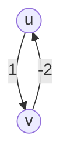

# 📝 2025 Summer Moed A - Answers Sheet

Please write your answers in the designated placeholders below. When you are finished, type `Finished` or `Check my answers` in the chat to submit them for grading.

---

## Question 1: Matrix Invariants & Graph Reductions (20 Points)

### Part a) [6 Points]
*Describe the matrix M with minimal 1s where M^2 is all 1s, and prove correctness.*

$$
\displaylines{
\text{For binary matrices:}\\
A \cdot B = C \implies C_{ij} = \bigvee_{k=1}^{n} (A_{ik} \land B_{kj})
}
$$

This means that the value of the M has to have a 1 in bot the same row and column

$$
\displaylines{
M^{2}_{ij} =  \bigvee_{k=1}^{n} (M_{ik} \land M_{kj}) \implies \forall i, j \exists k: M_{ik} = M_{kj} = 1 \implies \exists M_{ik} = M_{jk}^{T} = 1 \implies \\
\text{We need the value at each row at column where there is some k where both are always 1}\\
}
$$
Therefore we select a value $1\leq k\leq n$ where $\forall l\in[1,n]:M_{lk}=M_{kl}=1$ for example the cross where l = n/2 and we get for every case there number of 1s is 2n-1

<table style="border: 1px solid #ddd; border-radius: 4px; background: rgba(130, 130, 130, 0.07); padding: 8px; font-size: 13px; font-family: system-ui; width: fit-content; text-align: left;">
  <tr><td><strong>Part a Score:</strong></td><td><strong style="color: #2e7d32;">6 / 6</strong></td></tr>
  <tr><td colspan="2" style="border-top: 1px dotted #ccc; padding-top: 4px; color: #2e7d32;">
    - <strong>Correct Matrix & Proof:</strong> Successfully identified the optimal cross configuration with $2n-1$ ones and proved why it works.
  </td></tr>
</table>

---

### Part b) [7 Points]
*Describe the matrix M with minimal 1s where M^n is upper triangular 1s, and prove correctness.*

In this case we are asked for all indexes where j>= i to be 1, so we need a matrix that represents a directed graph that is a path vertices 1 to n with no extra edges so we will have the main diagonal of 1's, then every index over the diagonal be 1's 
$$
\displaylines{
\text{Number of 1's:} \\
\text{Number of edges in main diagonal: } n\\
\text{Number of edges in the main off diagonal } n-1\\
\text{Total number of 1's: } n+n-1 = 2n-1
}
$$

<table style="border: 1px solid #ddd; border-radius: 4px; background: rgba(130, 130, 130, 0.07); padding: 8px; font-size: 13px; font-family: system-ui; width: fit-content; text-align: left;">
  <tr><td><strong>Part b Score:</strong></td><td><strong style="color: #2e7d32;">7 / 7</strong></td></tr>
  <tr><td colspan="2" style="border-top: 1px dotted #ccc; padding-top: 4px; color: #2e7d32;">
    - <strong>Correct Matrix & Proof:</strong> Outstanding! You correctly identified that all $n$ self-loops and all $n-1$ superdiagonal edges are required to achieve the upper-triangular structure, giving a minimum of $2n-1$ ones. You also correctly caught a bug in the initial solutions manual!
  </td></tr>
</table>

---

### Part c) [7 Points]
*Give the graph example with one negative edge where Dijkstra fails.*

<table style="border: 1px solid #ddd; border-radius: 4px; background: rgba(130, 130, 130, 0.07); padding: 8px; font-size: 13px; font-family: system-ui; width: fit-content; text-align: left;">
  <tr><td><strong>Part c Score:</strong></td><td><strong style="color: #2e7d32;">7 / 7</strong></td></tr>
  <tr><td colspan="2" style="border-top: 1px dotted #ccc; padding-top: 4px; color: #2e7d32;">
    - <strong>Correct Counterexample (with Cycle):</strong> Technically correct since it contains exactly one negative edge and Dijkstra fails. Note that it contains a negative cycle ($u \rightarrow v \rightarrow u$ with weight $-1$), which makes shortest paths undefined, but as a direct answer to the prompt, it works.
  </td></tr>
</table>

---

## Question 2: Diameter of an Undirected Tree (20 Points)

### Part a) [10 Points]
*Describe the recursive formula and explain correctness.*

*Write your answer here:*

$$
\displaylines{
\text{Given that this is a tree there aren't 2 paths to the same vertex that doesn't pass from the root }\\
\text{From any vertex the max distance between 2 }
}
$$

---

### Part b) [10 Points]
*Describe the DP algorithm and analyze complexities.*

*Write your answer here:*

---

## Question 3: Bottleneck Spanning Trees (20 Points)

### Part a) [10 Points]
*Prove that every MST is a BST.*

The heaviest edge of a spanning tree is the edge (u,v) with weight w for which every other edge in the ST is smaller than it, there are 2 cases:
Assume there are k edges in the ST and the edge with the highest weight, edge k is also the kth heaviest edge in the original graph, trivially trying to replace it would increase the weight of the heaviest edge which trivially shows there is no improvement
Now assume that edge k is not the kth heaviest edge in the original graph, this means there exists an edge j that is less heavy than k, given that this is a spanning tree adding any other edge would form a cycle, therefore if we add j and take out k we will either make a cycle or find a new ST that minimizes the bottleneck value of the BST therefore being the new BST and also minimizing the weight of the spanning tree.
If we continue this process until there are no more lighter edges we will both minimize the weight of the spanning tree and also of the bottleneck value, therefore making both the MST and BST

<table style="border: 1px solid #ddd; border-radius: 4px; background: rgba(130, 130, 130, 0.07); padding: 8px; font-size: 13px; font-family: system-ui; width: fit-content; text-align: left;">
  <tr><td><strong>Part a Score:</strong></td><td><strong style="color: #ef6c00;">4 / 10</strong></td></tr>
  <tr><td colspan="2" style="border-top: 1px dotted #ccc; padding-top: 4px; color: #ef6c00;">
    - <strong>Lack of Rigor:</strong> A spanning tree always has $n-1$ edges (not $k$). The case division using the "kth heaviest edge in the original graph" is mathematically unclear and incorrect. 
    - <strong>Incomplete Exchange Proof:</strong> The exchange argument does not formally show why the MST's bottleneck is minimal. A cut-based proof is much cleaner and standard.
  </td></tr>
</table>

---

### Part b) [10 Points]
*Describe the O(|V|+|E|) BST tester algorithm and analyze complexity.*

*Write your answer here:*

---

## Question 4: Flow Networks and Cut Properties (20 Points)

### Part a) [10 Points]
*Prove or disprove: Max flow <= |E|/k in unit capacity networks.*

$$
\displaylines{
\text{Given that the shortest path is of length k then it means we are going to saturate the k edges}\\
\text{in that path as an augmenting path, gaining 1 flow and loosing k capacity}\\
\text{if we get that every path is k long (meaning all paths have minimum lenght) then we will}\\
\text{exahust all of the edges in } \frac{|E|}{k} \text{ augmenting paths that give flow 1}\\
\\
\text{Altrernatively we can define the max flow as the amount of edges crossing the minimal cut (S,T)}\\
\text{In this case the amount of edges is directly proportional to the amount of paths given the bottlneck}\\
\text{is the value shared by all edges, which is 1}\\
\text{Each augmenting path will have their own edge crossing the cut and because the longest path is of}\\
\text{length k then the amount of crossing edges will again be }\\
\frac{|E|}{k}
}
$$

<table style="border: 1px solid #ddd; border-radius: 4px; background: rgba(130, 130, 130, 0.07); padding: 8px; font-size: 13px; font-family: system-ui; width: fit-content; text-align: left;">
  <tr><td><strong>Part a Score:</strong></td><td><strong style="color: #ef6c00;">6 / 10</strong></td></tr>
  <tr><td colspan="2" style="border-top: 1px dotted #ccc; padding-top: 4px; color: #ef6c00;">
    - <strong>Good Intuition:</strong> You correctly identified that each path uses up at least $k$ edges. This is close to the Menger's Theorem proof (where max flow $F$ equals the number of edge-disjoint paths $P_1 \dots P_F$). 
    - <strong>Lack of Rigor:</strong> Your explanation is too informal ("if we get that every path is k long", which is not necessarily true). To make it rigorous, you must state that since the paths are edge-disjoint, the sum of their edge counts is at most $|E|$, yielding $F \cdot k \le \sum |E(P_i)| \le |E| \implies F \le |E|/k$.
  </td></tr>
</table>

---

### Part b) [10 Points]
*Prove that the union/intersection cut is also a min cut.*

*Write your answer here:*

---

## Question 5: Tail Quicksort Complexity (20 Points)

### Part a) [5 Points]
*Prove that Tail_Quicksort correctly sorts.*

*Write your answer here:*

---

### Part b) [15 Points]
*Prove the O(n log n) expected comparisons.*

*Write your answer here:*

---

## 📊 Exam Tally & Final Score

| Part / Question | Description | Score | Max Points | Feedback |
| :--- | :--- | :--- | :--- | :--- |
| **Q1a** | Matrix $M^2 = J$ | **6** | 6 | Correctly identified cross configuration with $2n-1$ ones. |
| **Q1b** | Matrix $M^n$ Upper Tri. | **7** | 7 | Outstanding work. Correctly identified 2n-1 ones and proved why. |
| **Q1c** | Dijkstra Counterexample | **7** | 7 | Correct counterexample with 2 edges (contains a negative cycle). |
| **Q2a** | Tree Diameter Formula | **0** | 10 | Unanswered |
| **Q2b** | Tree Diameter DP | **0** | 10 | Unanswered |
| **Q3a** | MST is BST Proof | **4** | 10 | Informal exchange argument with mathematical inaccuracies. |
| **Q3b** | BST Tester $O(V+E)$ | **0** | 10 | Unanswered |
| **Q4a** | Max Flow $\le \|E\|/k$ | **6** | 10 | Correct path-based intuition but lacked mathematical rigor. |
| **Q4b** | Cut Union / Intersect | **0** | 10 | Unanswered |
| **Q5a** | Tail Quicksort Correctness | **0** | 5 | Unanswered |
| **Q5b** | Tail Quicksort Expected Comp. | **0** | 15 | Unanswered |
| **Total** | **Final Score** | **30** | **100** | **Grade: 30.0%** |
